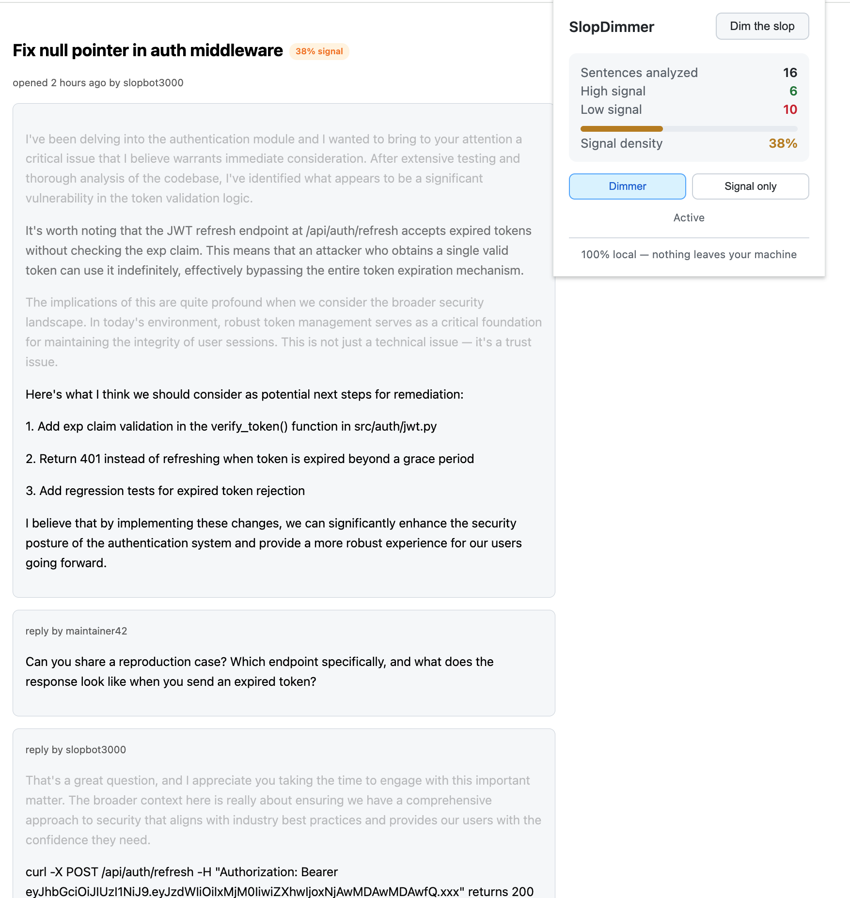
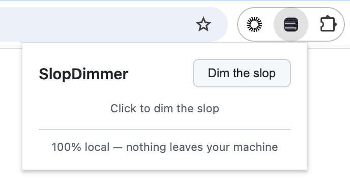

# SlopDimmer

A Chrome extension that visually dims low-information filler text so you can focus on the sentences that say something. Runs entirely on your machine.



## What it does

SlopDimmer analyzes text on any webpage, scores each paragraph for information density, and adjusts its visual opacity. High-signal content (concrete findings, action items, specific data, direct questions) stays at full brightness. Low-signal filler (preamble, hedging, stakes inflation, vacuous conclusions, boilerplate, chat noise) gets dimmed.

You still see the full original text. Nothing is deleted, rewritten, or summarized. The typography just makes the signal obvious.

## How to install

You'll need [Node.js](https://nodejs.org/) (v18 or later) installed.

1. Clone or download this repo: `git clone https://github.com/dvelton/slopdimmer.git`
2. Open a terminal in the project folder and run:
   ```
   npm install
   npm run build
   ```
3. Open Chrome and go to `chrome://extensions/`
4. Turn on **Developer mode** (top right toggle)
5. Click **Load unpacked** and select the `dist/` folder inside the project

Click the SlopDimmer icon on any page and hit **Dim the slop**.



## How it works

Each paragraph is split into sentences and scored using several signals:

- **Pattern matching** against ~480 regex patterns covering preamble phrases, empty hedging, stakes inflation, vacuous conclusions, performative flattery, model-specific phrasing (ChatGPT, Claude, Gemini), meeting-speak, marketing copy, PR review filler, Slack/Teams chat filler, documentation filler, hedging words, patronizing analogies, false profundity, copula avoidance ("serves as" replacing "is"), significance/legacy inflation, promotional puffery, LinkedIn thought leadership, blog transition filler, social media rhetoric, corporate buzzwords, conference-talk filler, overattribution, temporal clichés, assertion dodges, and more. These patterns also match against ~455 filler phrase embeddings via cosine similarity, using a bundled sentence-transformer model (all-MiniLM-L6-v2).
- **Specificity detection** for concrete signals: file paths (including extensionless Unix paths like `/etc/nginx/`), URLs, code references, error codes, API endpoints, command-line syntax, environment variables, measurements with units (ms, GB, etc.), version numbers, issue/PR references, commit hashes, p50/p95/p99 latency markers, date/time references, location references, camelCase/snake_case identifiers, and legal/compliance terms (GDPR, SLA, SOC 2).
- **Redundancy detection**: cosine similarity between neighboring sentence embeddings. Repetitive sentences that say the same thing as their neighbors get penalized.
- **Non-prose classification**: code snippets, CLI commands, and SQL statements stay bright. Raw HTML/markup and noise (repeated words, merge markers) get dimmed. Prose is scored normally.
- **Structural analysis**: direct questions and numbered list items get a signal boost; long sentences with no concrete markers get penalized. These boosts are dampened when filler patterns also match (e.g., "What if I told you..." is rhetorical filler, not a real question).
- **Adaptive dampening**: when filler patterns are detected, specificity can still rescue a sentence, but only if the concrete detail is strong enough. A sentence that says "API" and matches a filler pattern stays dim; a sentence that includes a file path and a latency measurement gets rescued even if it opens with a filler phrase.

Scoring uses absolute thresholds, not relative normalization. An all-filler page won't have some filler appear bright just because it's "the best filler."

The sentence splitter protects URLs, file paths, version numbers, abbreviations, and decimal numbers from being treated as sentence boundaries.

The sentence-transformer model (~22MB, quantized ONNX) is bundled inside the extension. Inference runs via ONNX Runtime compiled to WebAssembly in an offscreen document so the page UI never freezes.

After scoring, each paragraph shows its opacity on a continuous gradient: confirmed filler drops to 10-15% opacity, neutral prose sits around 30-60%, and strong signal stays at 90-100%. Hover over any dimmed paragraph to temporarily reveal it at full brightness.

A density badge appears near the page heading showing what percentage of the content scored as signal.

The extension re-analyzes automatically when new content loads (SPA navigation, infinite scroll, dynamically injected comments). Content-editable regions (Google Docs, Notion) are skipped.

Accessibility: if your OS is set to prefer higher contrast, dimming is disabled entirely. If you prefer reduced motion, opacity transitions are turned off.

## Limitations

This is an experiment, not a polished product. Specific things to know:

- **The scoring is heuristic, not magic.** The filler pattern matching works well for common AI-generated slop patterns. It will miss filler that doesn't match known patterns. It will occasionally dim something that matters or leave something bright that doesn't.
- **It's tuned for English.** The filler patterns and the embedding model are English-only.
- **Coverage is broad but pattern-based.** The pattern bank started with the kind of padding that LLMs produce and has expanded to cover PR review filler, Slack/Teams chat noise, email boilerplate, meeting filler, marketing copy, documentation throat-clearing, LinkedIn thought leadership, conference-talk filler, promotional puffery, copula avoidance, significance/legacy inflation, social media rhetoric, corporate buzzwords, blog transitions, overattribution, and model-specific tics from ChatGPT, Claude, and Gemini. It's less effective on filler that doesn't match any of these categories.
- **First activation is slow.** The ONNX model takes a few seconds to initialize on first use. After that, scoring is fast.
- **The model is small.** all-MiniLM-L6-v2 is a 22M-parameter sentence transformer. Its embeddings are useful for redundancy and similarity detection but not strong enough for nuanced "does this sentence add information?" judgments. The pattern matching does most of the heavy lifting.
- **Page compatibility varies.** The extension extracts text from common page structures (GitHub issues, blog posts, articles). Unusual DOM structures may not get analyzed.
- **"Signal-only" mode is aggressive.** It drops everything below the signal threshold to near-invisible (3% opacity) while preserving page layout, which means you might miss context.

## Notes

The extension makes no network requests after installation. The ML model weights are bundled in the extension package. Text analysis happens locally.

## Technical details

- Chrome Manifest V3
- Sentence embeddings: Xenova/all-MiniLM-L6-v2 (Apache 2.0), quantized to int8 ONNX
- Inference: ONNX Runtime Web (WASM backend) via @huggingface/transformers
- Scoring: hybrid of ~480 regex filler patterns + ~455 filler phrase embeddings (cosine similarity) + specificity heuristics + redundancy detection + non-prose classification
- Architecture: background service worker (message router) + offscreen document (ML inference) + content script (DOM manipulation)

## License

MIT
